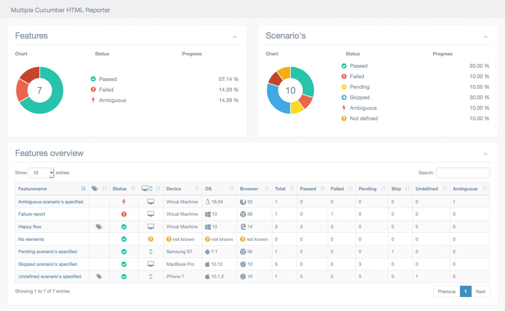

# perfecto-webinar-protractor
This repo holds the protractor project that is used during the webinar of the 27th of July 2017

The master branch will hold the default setup

This branch will hold the same setup as the master and the page-objects branch, but all code is now in TypeScript

## Checking your environment
Before cloning and installing the project make sure you have NodeJS installed on your machine. This needs to be at least version `6.9.x`.
Execute the following command in a terminal to see the version of NodeJS is running `node -v`. If it is lower than `6.9.x` you should upgrade NodeJS


## Install project
Clone the project to your local machine with 

```bash
    git clone https://github.com/wswebcreation/perfecto-webinar-protractor.git
```

When the project is cloned install all the dependencies with

```bash
    cd perfecto-webinar-protractor
    npm install
```

## Run local
Protractor needs to have a selenium server running locally to connect to the browser. This setup uses `directConnect` and means that no separate selenium server needs to be started. This is all done out of the box.
 
To run the tests local execute `npm run test.local`

## Run on the perfecto cloud
Before you are able to run against the Perfecto cloud add a file to your project called `perfecto.config.json` and add the following data to it

```javascript
    {
        "password": "yourPassword",
        "user": "yourUsername",
        "seleniumAddress": "yourCloudSeleniumAddress"
    }
```

If added you can run the tests with `npm run test.perfecto`

## Custom reporter
In this setup we use, next to the report client Perfecto also delivers, a custom reporter called [multiple-cucumber-html-reporter](https://github.com/wswebcreation/multiple-cucumber-html-reporter). 

This report can also be used for local development / debugging the tests. It will hold screenshots and stacktrace (on failure). If you run the command mentioned above and add `-- --openReportInBrowser` to it, then the report will automatically be opend in the default browser of you operating system



## Image comparison
There is also a demo for a free image comparison module called [protractor-image-comparison](https://github.com/wswebcreation/protractor-image-comparison). By default the image comparison is **NOT** run when you use the above commands.

When you add `-- --cucumberOpts.tags=@image-comparison` to the above commands it will only run the image comparison feature-file